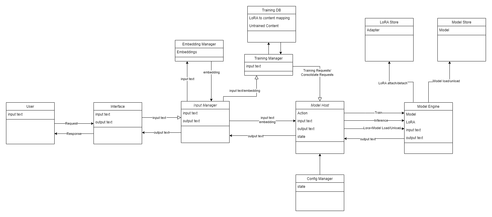

# COmputed COntextualization for Low Rank Adaptation

Local Large Language Model Small Scale Learning. Currently for both LoRA and qLoRA:

* I(*we*) can train LoRA on a small dataset and get an inference based on the content.
* We can load multiple LoRA into a model, but only one is active at at time using set_adapter().
* We can load a model, apply a LoRA, and then train it to generate a combined LoRA adapter based on the model + LoRA.
* We can't stack LoRA and have the inference reply with both knowledgesets, because the LoRA's replace the same data/layers.
  * Can LoRA's themselves be averaged? Probably, but probably not satisfactorily.
  * A comparison would be that we are doing incremental checkpoints, not differential.

[Old README.md](old_README.md "The new readme is a better distillation of the idea, but the old readme has some good information too")

## What is this?

There is some code here, but it's not going to be useful at this point. The idea here is that LLM's can't be trusted. They're awesome...but

* LLMs hallucinate and make things up
* Local LLMs have small memories
  * Their small memories get consumed embeddings fairly quickly. Bigger memories are less performant and 'will never be enough'.
* If a LLM doesn't have information it needs to understand the context, it's not going to provide a good answer

This git is not Science™, it takes the approach that perfect can be the enemy of good and good information has its uses.

This git wants to continually train your local large language model on your data. e.g.

## Embeddings to the rescue?

Memory mechanisms are available that will dynamically embed parts of your conversation into the LLM.

They consume context and provide a better answer than not using embeddings, and they're a great way to get started.

What if we had more cycles to spend on the problem?

## The Limitations of Embeddings and Local LLMs

Consider the workflow of a chat:

> User: Hey Chatbot, what is the capital of France?
>
> Chatbot: The capital of France is Paris User
>
> User: Thanks Chatbot. Can you do me a favour and just answer in one word for simple things like that?
>
> Chatbot: Ok
>
> User: Hey Chatbot, are you sentient?
>
> Chatbot: No
>
> User: How do you know?
>
> *Chatbot and user have a long conversation about sentience*
>
> *over 2000 tokens later*
>
> User: Hey Chatbot, what is the capital of France?
>> Embedding:
>>
>> User: Hey Chatbot, what is the capital of France?
>>
>> Chatbot: The capital of France is Paris User
>
> Chatbot: The capital of France is Paris User
>
> User: didn't I tell you just answer in one word for simple things like that?
>
>> Embedding:
>>
>> User: Thanks Chatbot. Can you do me a favour and just answer in one word for simple things like that?
>>
>> Chatbot: Ok
>
> Chatbot: Yes you did, sorry.

That cycle will repeat itself, probably. The LLM will forget the context of the conversation, it won't improve, and the user will have a static experience resulting in frustration.

## Dynamic Fine-tune

LoRA(or QLoRA) is a fine-tuning mechanism that can be applied to a LLM. I've seen 5 main(overlapping) ideas behind LoRA/fine-tune:

* Use LoRA for behaviour. Get them better at stories/chat/programming or writing in a specific style.
* Use LoRA for tasking by prompting improvements. "Provide an output that can do X".
* Improve the overall model. Get them better at everything by using high quality data
* Undo censorship on models.
* Content upgrades. Give the model a specialized vocabulary to specific tasks/roles.

They can help with the hallucination problem, but they don't fix it. Embeddings seem to be a necessary part of the solution.

## A Learning Local LLM!

What if we could dynamically fine-tune the LLM to the conversation? And stack the fine-tuning? And periodically roll up the fine-tuning?

> User: Hey Chatbot, what is the capital of France?
>
> Chatbot: The capital of France is Paris User
>
> User: Thanks Chatbot. Can you do me a favour and just answer in one word for simple things like that?
>
> Chatbot: Ok

Arbitrary point at which the front end decides to LoRA-tize the previous text, and then applies it to the LLM. The conversation continues.

> User: Hey Chatbot, are you sentient?
>
> Chatbot: No
>
> User: How do you know?

Chatbot and user have a long conversation about sentience. The front end periodically LoRA-tizes the conversation and stacks them to a reasonable point, and it also may roll them up when appropriate.

> *over 2000 tokens later*
>
> User: Hey Chatbot, what is the capital of France?
>> Embedding:
>>
>> User: Hey Chatbot, what is the capital of France?
>>
>> Chatbot: The capital of France is Paris User
>
> Chatbot: Paris
>
> User: That's the one, thanks.

It may not work like that. You may need to force a conversation where Chatbot has short answers before launching into a long and meaningful about sentience.

Maybe the embeddings are included in the fine-tune.

Maybe the embeddings are tracked which have been fine-tuned in which LoRA.

Maybe you have a catalog of fine-tunes, and you can remove them from the stack when they're no longer relevant or not performing well.

Maybe you can ask the chatbot to forget a conversation.

## You can't train a Local LLM like that

caveat: no one has said that, but I'm sure someone will, and it's probably true.

Focusing on what we can do:

* I can create a LoRA on a single line of content and give it knowledge without affecting other knowledge (noticeably)
  * Trial and error shows that specific learning rate + alpha + batch etc. are required to make this work
* I can use GTPQ to minimize memory use to LoRA-tize a 30b model

Current blockers:

* I can't stack 4bit LoRA with GPTQ
* I can't stack QLoRA
* I haven't tried 8bit stacking yet
* Models don't have any concept of events happening in order, or on a relative date.

Advantages:

The model learns you, and becomes better at answering in a way that you want. If it doesn't, then modifying its responses to be how you like them is a good way for it to develop that skill because that exchange would be LoRA-tized. It would become a type of RLHF.

* https://arxiv.org/abs/2305.02301 *Distilling Step-by-Step! Outperforming Larger Language Models with Less Training Data and Smaller Model Sizes*
  * More people can potentially develop improvements their own data. i.e. commoditizing LLMs even further
* https://arxiv.org/abs/2305.15717 *The False Promise of Imitating Proprietary LLMs*
  * We're not imitating proprietary LLMs, so we're not limited in the same way.
* study that shows data quality is more important than model size *link*?
* Approach is applicable to enterprises and individuals
  * enterprises can begin with a 'dumber' model that improves with human/machine curated interactions additions
  * individuals *could* share LoRA's without sharing their data directly
  * both could begin with larger models, and as the dataset is generated, it could be used to train smaller models to be better.
  * both could begin with smaller models and uplift them over time if they accept a lower quality model to begin with.
  * smaller models are more performant, and for the same capacity as a larger model, the reduction in model size could be used to increase the context size for the same memory footprint of a larger model.

Avoiding pitfalls:

* Model quality degradation
  * mixing other quality data with the learned data will help the model maintain quality at the cost of learning speed
  * minimizing the learning rate can help the model maintain quality at the cost of learning speed
* Using a high learning rate will make the model dumb
* LoRA training takes time
  * a range of LoRA training settings has been tested, and needs more testing.
  * Currently, *10 epochs at 64 LoRA Rate, 128 LoRA Alpha, Learning rate 0.0001, 2 batch size, 256 cutoff, 0.05 LoRA dropout* will teach the model the 2023 Oscar award winner for best actor, including movie.
  * ~10 seconds is a small enough time that, on its own it would not make a significant difference to a conversation. Alternately "take a 1-minute break every 10 minutes while I learn" is a reasonable request.
* Stacking LoRA may increase resource usage
* Continually training may be time-consuming on resource strained devices. Offload micro LoRA training to cloud or other device.
  * I'm seeing ~ 2 hours to fine tune a 1/3 million word conversation, but that should not be a normal occurrence if the LoRA is being stacked and rolled up.
  * and/or, can we merge LoRA into other LoRA?

## We should still use embeddings

As previous, LLM's can't be trusted.

## What's next?

- &#x2611; Test to see if LoRA can be micro trained in a useful way
- &#x2612; Test to see if 4bit LoRA can be stacked with GPTQ in TextWebUI (not as 29/05/2023)
- &#x2612; Test to see if 4bit LoRA can be stacked with [JohnSmith](https://github.com/johnsmith0031/alpaca_lora_4bit) in TextWebUI (not as 29/05/2023)
- &#x2610; Test with GGML *doesn't seem possible yet?*
- &#x2610; Test with 8bit LoRA *it feels like compromising*
- &#x2610; Develop an automatic workflow that can LoRA-tize a conversation and stack it
- &#x2610; Develop a GUI for customizing the workflow (removing unwanted content by regenerating the LoRA containing it)
- &#x2610; Develop the 'offload to another device' workflow
- &#x2610; Differentiate behaviours between "Work Chatbot", "Personal Chatbot", "Instruct"
- &#x2610; Review QLoRA and see if it's a better fit. *isn't this what we've already been doing with GPTQ LoRA?...yes but no*
- &#x2610; Review GPTQLoRA. https://github.com/qwopqwop200/gptqlora
- &#x2610; Work out how to hit a moving target

## This is probably already a thing

I'm not aware of it, but I'm not aware of a lot of things. Sometimes you need to get out and push.

[*"Yeah, yeah, I know, I don’t have the math,"*](./sidequests/MATH.TXT)